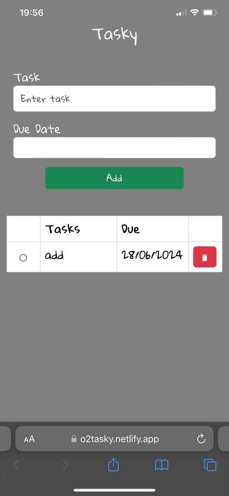

# TASKY

This is a ToDo List App that allows a user to add tasks which are displayed

The tasks or todos can be selected to show a completed status and can also be deleted when no longer needed

- [Tasky](https://o2tasky.netlify.app/) This is a live link to Tasky

# Overview
- Tasky is a simple and intuitive todo list application designed to help you keep track of your tasks and stay organized.
- Tasky provides an easy-to-use interface to manage all your tasks efficiently.

# Features
- Create and delete tasks
- Assign due dates to your tasks to keep track of deadlines 
- User-friendly interface with a clean design for easy navigation and task management

# Screenshots

# Contact
For any questions or suggestions, please contact me on [Twitter](https://twitter.com/_02ahmed)